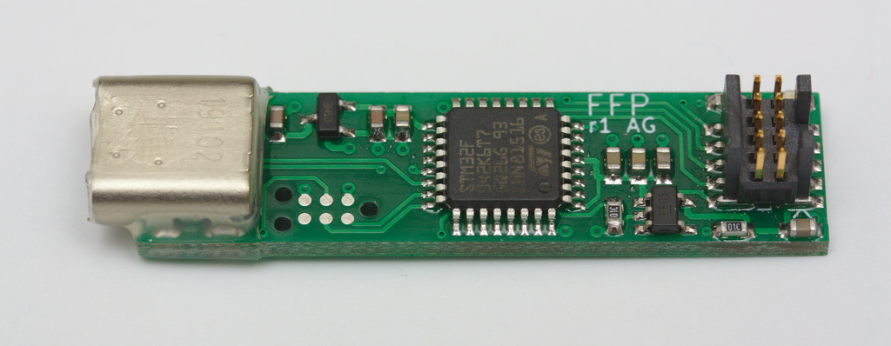

# FFP: Flash/FPGA Programmer

FFP is a dead-simple USB to bidirectional SPI bridge for programming iCE40
FPGAs and their SPI flash. The hardware is an STM32F042 and not much else.
Firmware and host software is written in Rust.



See [software/](software/) for the host-side software, [firmware/](firmware/)
for the embedded device firmware, and [hardware/](hardware/ffp/) for the
hardware design files.

## Pinout

The FFP r1 hardware uses a 5x2 pin 0.05"-pitch connector, which is also
commonly used for Cortex family microcontrollers for SWD and JTAG. The pinout
is deliberately compatible (though note `RESET` is moved) to allow hardware
reuse and for compatibility with tools such as TagConnect cables. It would
also be possible to add SWD support to FFP without changing the hardware,
permitting programming of Cortex-M devices.

```ascii
          ______
    3v3 --|1  2|-- FLASH DI / FPGA DO
    GND --|3  4|-- CLK
    GND --|5  6|-- CS
        x-|7  8|-- FPGA nRST
    GND --|9 10|-- FLASH DO / FPGA DI
          ------

```

This is the same pinout used by
[amp_flashprog](https://github.com/adamgreig/amp_flashprog), a custom firmware
for [Black Magic Probes](https://github.com/blacksphere/blackmagic) to bitbang
SPI to the same ends.

## Licence

Software and firmware is licensed under either of

* Apache License, Version 2.0 ([LICENSE-APACHE](LICENSE-APACHE) or
  http://www.apache.org/licenses/LICENSE-2.0)
* MIT license ([LICENSE-MIT](LICENSE-MIT) or http://opensource.org/licenses/MIT)

at your option.

Hardware design files are licensed under the Creative Commons Attribution
license ([CC-BY](https://creativecommons.org/licenses/by/4.0/)).
